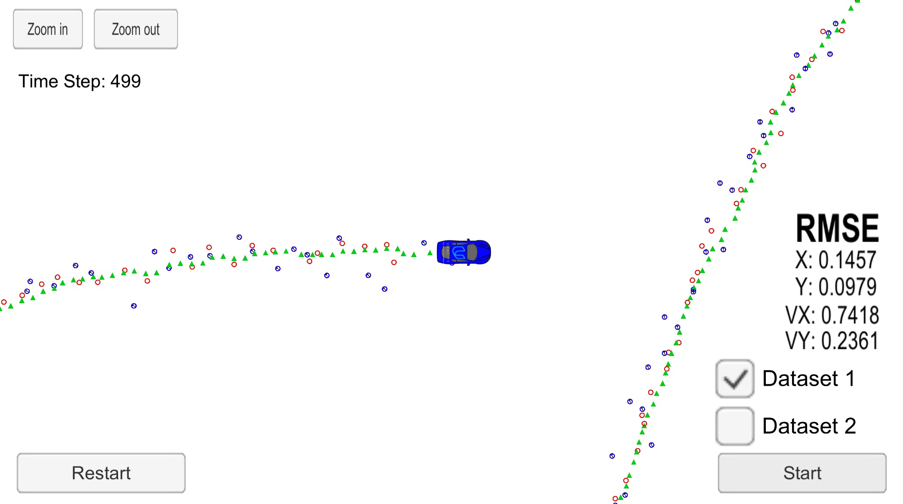
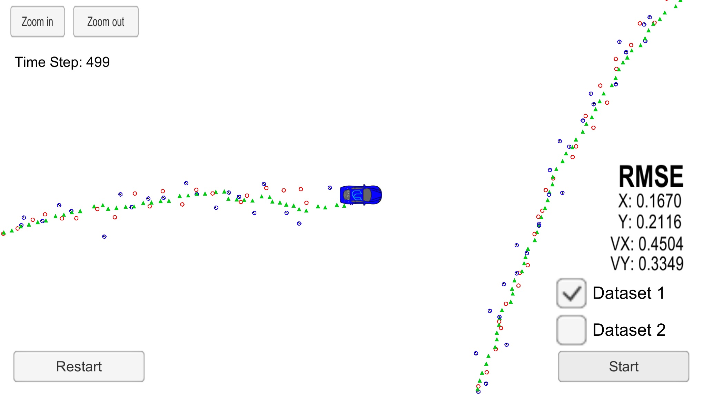

# Unscented Kalman Filter Project 
Self-Driving Car Engineer Nanodegree Program

In this project I utilize an Unscented Kalman Filter to estimate the state of a moving object of interest with noisy lidar and radar measurements. Passing the project required obtaining RMSE values that are lower that the tolerance outlined in the project rubric (RMSE <= [.09, .10, .40, .30]) 

# Results

## Using only radar measurements

## Using only laser measurements

## Fusing both sensor measurements

# Basic Build Instructions

1. Clone this repo.
2. Make a build directory: `mkdir build && cd build`
3. Compile: `cmake .. && make`
4. Run it: `./UnscentedKF` Previous versions use i/o from text files.  The current state uses i/o
from the simulator.

